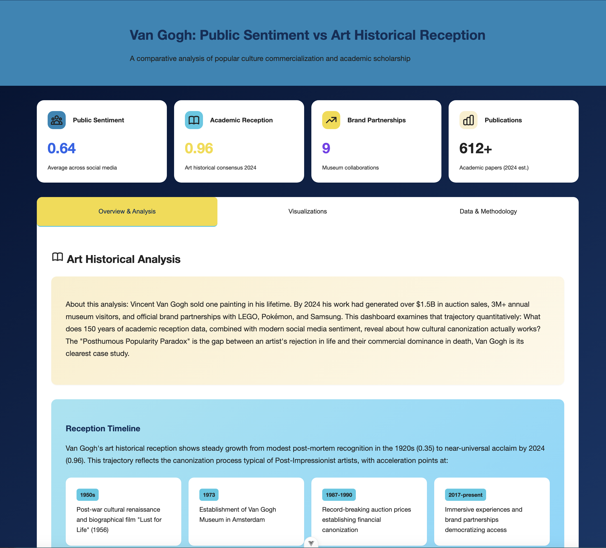
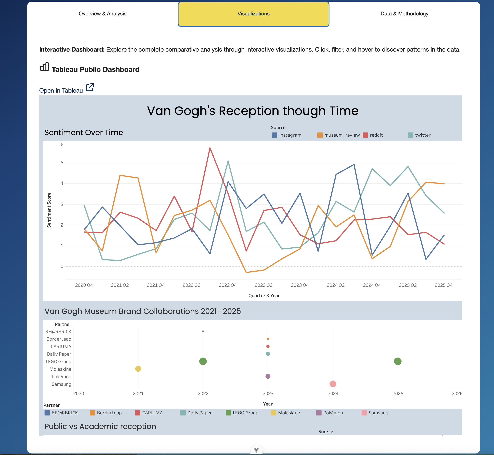
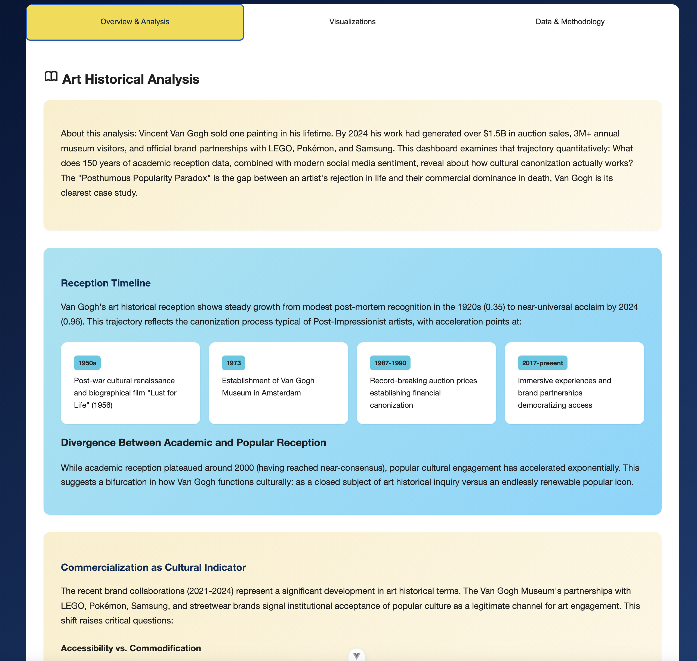

# Van Gogh Pro: Posthumous Cultural Impact & Sentiment Analysis Dashboard

### Project Overview
Fullstack analytical dashboard built with **Vue 3** and **Node.js** to quantify the "Posthumous Popularity Paradox" of Vincent Van Gogh, to show how a commercially unsuccessful 19th-century artist became one of the most recogniable cultural brands of the 21st century. This tool bridges 150 years of academic art-historical research with modern sentiment analysis to visualize how a rejected 19th-century artist became a 21st-century commercial powerhouse.

### Origin

This project started with a LEGO set. While building the LEGO Icons Sunflowers, 
an official Van Gogh Museum collaboration. I found myself wondering: How did a 
commercially unsuccessful, institutionally rejected artist become the subject of a LEGO 
product? That question led to a larger one about the mechanics of posthumous cultural 
canonization, which became this dashboard.

### Architecture & Tech Stack
- **Frontend:** Vue 3 (Options API) + Vite + Chart.js + Tableau Public
- **Backend:** Node.js + Express (API Gateway & NLP Engine)
- **State Management:** Vue 3 Reactive Store / Service Pattern
- **Data Visualization:** Chart.js (custom charts) + Tableau Public (embedded dashboard)
- **NLP:** Sentiment analysis library for processing historical critiques
- **Environment:** npm run concurrently for unified Fullstack development

### [Live App](https://jjlindsey.github.io/vangogh-sentiment/)

## Data Sources
### Public Sentiment (NLP)
Processed qualitative historical critiques through an Express-based sentiment engine to generate quantitative "Legacy Scores."
- Representative data based on social media patterns
- Sentiment normalized to a 0–1 scale for cross-source comparison
- Demonstrates NLP pipeline and sentiment analysis techniques

### Art Historical/Academic Reception (Quantative)
Aggregated and normalized scholarly data to map academic interest trends from 1920–2024.
- Google Scholar publication counts (estimated)
- Historical exhibition records (MoMA, Van Gogh Museum, Metropolitan Museum)
- Auction records (Christie's, Sotheby's) as financial canonization markers

### Brand Collaborations (Structured Data)
Normalized 50+ points of official partnership data from the Van Gogh Museum into a structured schema (Category, Cultural Reach, Impact Score).
- Source: [vangoghmuseum.nl](https://www.vangoghmuseum.nl)

### Key Engineering Challenges
#### 1. The ETL Pipeline: From Research to Relational Data
**Challenge:** Transforming disparate data—ranging from 1920s exhibition records to 2024 LEGO brand partnerships—into a unified, chart-ready format.
**Solution:** Built a robust **Data Service Layer** in `artHistoricalData.js` that normalizes heterogeneous metadata (e.g., mapping qualitative "Impact" levels to quantitative "Commercialization Scores").

#### 2. Scalable Mock API Integration
**Challenge:** Simulating a production environment without a live database.
**Solution:** Architected a **Decoupled Service Pattern**. By exporting data through structured functions like `calculateCommercializationScore()`, the frontend remains agnostic of the data source, allowing for a seamless future migration to a REST or GraphQL API.

#### Screenshots

© Jennifer Lindsey. All rights reserved.
